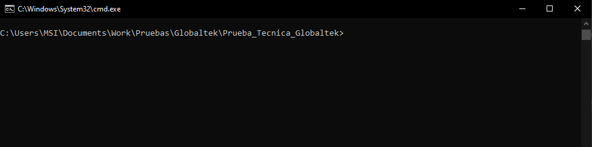
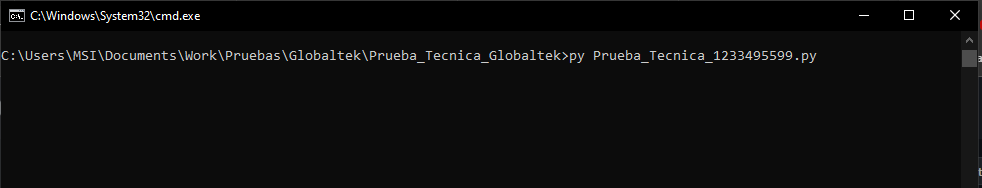
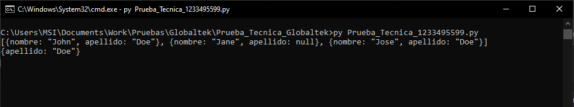
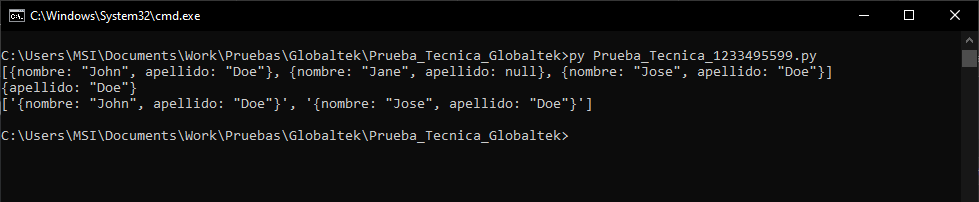

# Prueba Tecnica Globaltek
# Para el desarrollador Junior

En cualquier lenguaje de programación moderno, cree una función que itera a través de un 
arreglo de objetos (primer argumento) y devuelve un arreglo de todos los objetos que tienen el 
par propiedad valor coincidente (segundo argumento). La propiedad del segundo argumento
debe estar presente en todos los objetos del arreglo.

Por ejemplo, si el primer argumento es: 
[{nombre: "John", apellido: "Doe"}, {nombre: "Jane", apellido: null}, {nombre: "Jose", apellido: 
"Doe"}] 
Y el segundo argumento es: 
{apellido: "Doe"} 
Debe devolver un arreglo con los objetos coincidentes del arreglo: 
[{nombre: "John", apellido: "Doe"}, {nombre: "Jose", apellido: "Doe"}] 

# Generalidades

Se hizo un programa en Python 3.10.0, que cumple con los criterios del problema.

## Como usar

Esta programado en la version de Python 3.10.0 y funciona para las versiones 3.10.* 
Debe tener instalado un entorno de desarrollo o un editor de texto donde se pueda compilar el archivo.

Si no posee uno puede ingresar a https://www.python.org/ para descargar la ultima version.

Despues de tenerlo, podra abrir el archivo desde el IDLE Shell de Python o desde la consola de Windows

### Como usarlo por consola?

Estando en la consola de Windows

Ubique la consola en la carpeta donde esta el archivo Prueba_Tecnica_1233495599.py y escriba en la consola

        $ py Prueba_Tecnica_1233495599.py

La consola le pedira los datos, puede usar el archivo Casos_Prueba.txt para guiarse y probar algunos casos.

Al tener los datos, da al Enter y arrojara los resultados de la busqueda.

## FUNCIONALIDADES:

- Dada un conjunto de valores puede buscar segun la propiedad los objetos que coincidan con esa propiedad

*Por: Michael Ballesteros*
